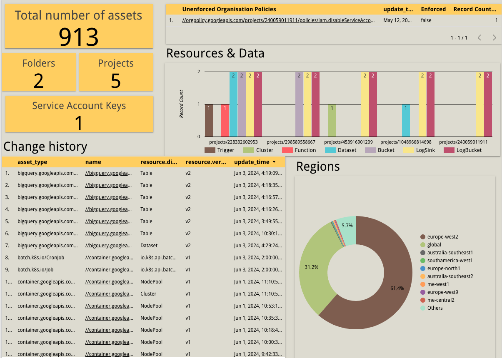

# gcp-cloud-asset-exporter

All-in-one repository to manage Cloud assets in Google Cloud Platform (GCP). This repository contains IaC (Terraform) for all GCP infrastructure and the Python code necessary for automating the export of cloud assets. Using this code, you can then visualize the data using Google's Looker Studio:



## Table of Contents
- [Prerequisites](#prerequisites)
- [Deploy IaC for GCP - Service account, IAM, PubSub Topic, Cloud scheduler](#deploy-iac-for-gcp---service-account-iam-pubsub-topic-cloud-scheduler)
- [Deploy Cloud function](#deploy-cloud-function)
- [View Looker Studio Dashboard](#view-looker-studio-dashboard)


## Prerequisites

Before you begin, ensure you have the following:

- Google Cloud SDK installed on your local machine. You can download it [here](https://cloud.google.com/sdk/docs/install).
  - For instructions on configuring the SDK, refer to [this link](https://cloud.google.com/sdk/docs/configurations).
- Terraform installed on your local machine for infrastructure provisioning. You can download it [here](https://www.terraform.io/downloads.html). 
  - For instructions on installing Terraform, refer to [this link](https://learn.hashicorp.com/tutorials/terraform/install-cli).
- Sufficient IAM to deploy and make the following changes:
  - Org level IAM
  - Project level IAM
  - Deploy Bigquery dataset
  - Deploy Cloud scheduler
  - Deploy Cloud functions
  - Deploy PubSub
  - Create Service account


## Deploy IaC for GCP - Service account, IAM, PubSub Topic, Cloud scheduler

From root, change into the terraform directory
```shell
cd infrastructure
```

Initiliase Terraform
```shell
terraform init
```

Plan and deploy Terraform
```shell
terraform plan & terraform apply -auto-approve
```

## Deploy Cloud function

From root, change into the application directory
```shell
cd application
```

Update variables on line 6 and line 7 in main.py

```python
6    org_id = "123456789"
7    project_id = "example-prj"
```
Run the gcloud command replacing:
- CLOUD_FUNCTION_NAME
- PUBSUB_TOPIC_NAME
- GCP_PROJECT
- REGION
- SERVICE_ACCOUNT_EMAIL

```shell
gcloud beta functions deploy CLOUD_FUNCTION_NAME \
 --runtime PYTHON_RUNTIME \
 --trigger-topic PUBSUB_TOPIC_NAME \
 --entry-point pubsub_to_bigquery \
 --project GCP_PROJECT \
 --region REGION \
 --service-account SERVICE_ACCOUNT_EMAIL
```

## View Looker Studio Dashboard
Using Looker studio, you can select the dataset created and drill down in to all assets in GCP the organisation. 


